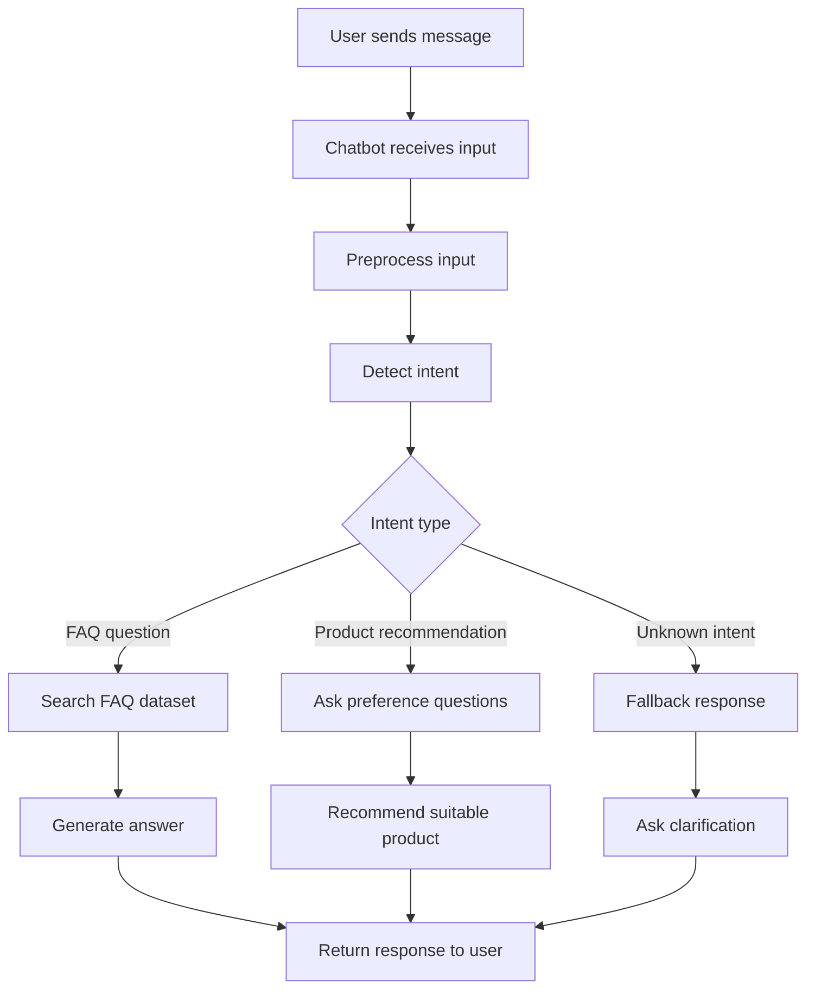

# AI Chatbot Developer Portfolio

## Overview

This repository is a professional portfolio for **Phan Tien Phat**, a Junior AI Chatbot Developer with around **2 years of practical experience** in building AI chatbot prototypes, FAQ automation workflows, customer support assistants, and product recommendation chatbot use cases.

The purpose of this portfolio is to present clear evidence of chatbot-focused skills, project documentation ability, business understanding, and AI automation use cases. This portfolio is designed to be used as a public profile link for expert verification.

## Professional Profile

| Field | Information |
|---|---|
| Name | Phan Tien Phat |
| Role | Junior AI Chatbot Developer |
| Experience | Around 3 years |
| Main Focus | AI Chatbot, FAQ Automation, Customer Support Assistant, Product Recommendation Assistant |
| Core Skills | Python, NLP, OpenAI API, Prompt Engineering, Chatbot Flow Design, Business Automation |

## Technical Skill Summary

I mainly work with:

- Python backend development
- Natural Language Processing basics
- OpenAI API integration
- Prompt engineering
- Chatbot conversation flow design
- FAQ dataset preparation
- API integration for chatbot workflows
- Basic frontend chatbot UI integration
- Documentation for AI automation systems

## Main Project Areas

### 1. Customer Support Chatbot

A chatbot designed to answer common customer questions and reduce repetitive support work.

Supported topics include:

- Product information
- Order support
- Return policy
- Shipping fee
- Store opening hours
- Basic troubleshooting
- Frequently asked questions

Evidence documents:

- [Customer Support Chatbot Case Study](docs/customer-support-chatbot-case-study.md)
- [Demo Transcripts](docs/demo-transcripts.md)
- [Testing Checklist](docs/testing-checklist.md)

### 2. E-commerce Product Recommendation Assistant

An AI assistant that helps customers find suitable products based on needs, preferences, budget, and product categories.

Evidence documents:

- [Product Recommendation Assistant Case Study](docs/product-recommendation-assistant-case-study.md)
- [API Integration Sample](docs/api-integration-sample.md)

### 3. Internal Business FAQ Assistant

A chatbot concept that helps staff quickly find answers from internal business documents, policy notes, and FAQ data.

Evidence documents:

- [Internal FAQ Assistant Case Study](docs/internal-faq-assistant-case-study.md)
- [Project Evidence Map](docs/project-evidence-map.md)

## Example Chatbot Workflow

## Sample Deliverables

For chatbot projects, I usually prepare:

- Chatbot conversation flow
- FAQ dataset structure
- Prompt templates
- API integration sample
- Deployment guide
- User guide for business users
- Testing checklist
- Documentation for maintenance and improvement

## Project Evidence Mapping

| Evidence Area | Description |
|---|---|
| Chatbot relevance | Portfolio focuses on chatbot, FAQ automation, customer support assistant, and product recommendation assistant |
| AI skill relevance | Uses OpenAI API, NLP basics, prompt engineering, and chatbot flow design |
| Business use case | Focuses on small business support and recommendation workflows |
| Documentation quality | Provides workflow, deliverables, use cases, testing checklist, and integration notes |
| Experience consistency | Portfolio states around 2 years of practical chatbot prototype and automation experience |
| Ownership consistency | Author name is Phan Tien Phat, matching the expert profile name |

## Certificate

I completed the Coursera course **AI For Everyone**.

Certificate information:

- **Certificate name:** AI For Everyone
- **Issuer:** Coursera
- **Holder name:** Phan Tien Phat
- **Purpose:** Supports foundational AI understanding and AI business use case awareness

More information: [Certificate Evidence](docs/certificate.md)

## Live Portfolio Page

This repository includes a simple static portfolio page:

- `index.html`
- `assets/css/style.css`

You can enable GitHub Pages from repository settings and use this repository as a public portfolio website.

## Author

**Phan Tien Phat**  
Junior AI Chatbot Developer  
Skills: Python, NLP, OpenAI API, Chatbot, Prompt Engineering, Automation
